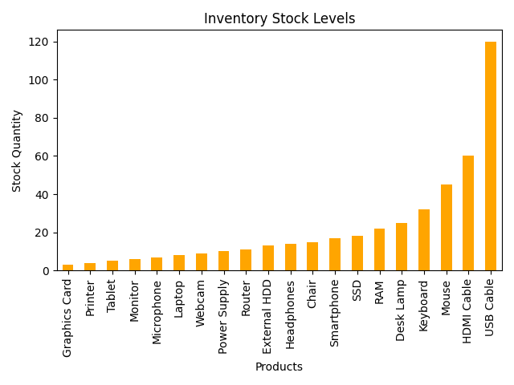

# inventory-management-analysis

This project analyzes inventory stock levels using Python, Pandas, Matplotlib, and FPDF.

The program reads inventory data from an Excel file, identifies low-stock products, 
generates a stock visualization chart, and creates a professional PDF inventory report automatically.

## Features

- Read inventory data from Excel
- Detect low-stock products
- Find the product with the lowest stock
- Generate stock level bar charts
- Create automated PDF reports
- Simple and business-oriented workflow

## Technologies Used

- Python
- Pandas
- Matplotlib
- FPDF
- Excel (.xlsx)

## Preview

# Author

JG Automation & Data
